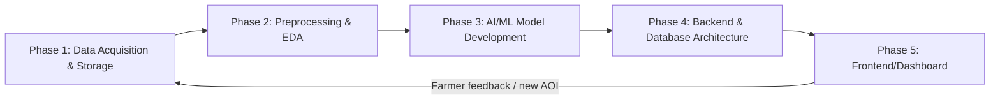
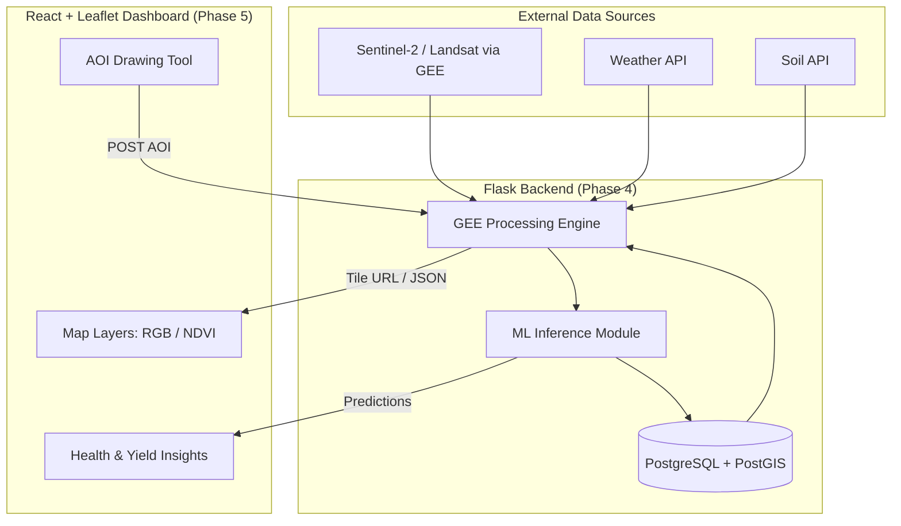

# Geo-Spatial AI (Satellite Data) for Precision Agriculture — System Architecture

## Overview

---

## Phase 1: Data Acquisition & Storage

**1. Objective**
Continuously acquire multi-source geospatial and meteorological data for a farmer's Area of Interest (AOI) and persist it in a queryable, versioned store — replacing ad-hoc script pulls with a repeatable pipeline.

**2. Data Flow**
- **Inputs:** AOI polygon/point + buffer (drawn via Leaflet-Geoman on the frontend), date range, cloud-cover threshold.
- **Processing:** Query satellite/weather APIs → filter by bounds, date, cloud % → composite (median/mosaic) → clip to AOI.
- **Outputs:** Raw/cached raster tiles (GeoTIFF/COG), time-stamped metadata (image ID, sensor, acquisition date, cloud %), weather time series (CSV/Parquet), stored in object storage + a metadata DB table.

**3. Recommended Technologies**
| Category | Tool |
|---|---|
| Satellite imagery | Google Earth Engine (`earthengine-api`), Sentinel-2 L2A (`COPERNICUS/S2_SR_HARMONIZED`), Landsat-8/9 as fallback for historical depth, Sentinel-1 SAR for cloud-penetrating soil moisture |
| Weather data | Open-Meteo API (free, no key) or NASA POWER API for temperature/rainfall/humidity |
| Soil data | SoilGrids REST API (ISRIC) for texture, pH, organic carbon |
| Orchestration | Python `apscheduler` / cron, or Airflow if you want to demonstrate pipeline scheduling |
| Storage | Local/GCS bucket for raster tiles (COG format), PostgreSQL/PostGIS or SQLite+SpatiaLite for metadata & vector AOIs |
| Auth | Service account JSON (`ee-key.json`) — ensure it's gitignored |

**4. Challenges & Mitigation**
- **Cloud cover / data gaps:** Use median composites over a rolling date window and fall back to Sentinel-1 SAR when optical is unusable.
- **GEE quota/rate limits:** Cache computed NDVI images as exported assets or COGs in cloud storage instead of recomputing per request.
- **Large raster sizes:** Export at reduced scale (10–20m) and use Cloud-Optimized GeoTIFFs for partial reads.
- **Credential leakage:** Never commit `ee-key.json`; use environment variables/secrets manager in deployment.

---

## Phase 2: Data Preprocessing & Exploratory Data Analysis (EDA)

**1. Objective**
Transform raw imagery/weather data into clean, analysis-ready features (vegetation indices, time-series trends, anomaly flags) and validate data quality before modeling.

**2. Data Flow**
- **Inputs:** Raw bands (B2–B12) from Phase 1, weather time series, historical NDVI archive.
- **Processing:** Compute vegetation/water/soil indices, cloud masking (`QA60`/SCL band), temporal smoothing (Savitzky-Golay or rolling mean to remove noise), outlier detection, correlation analysis between NDVI and rainfall/temperature.
- **Outputs:** Feature tables per AOI per date (NDVI, NDWI, EVI, SAVI, rainfall, temp), EDA visualizations (NDVI time-series charts, correlation heatmaps), a documented "data quality report".

**3. Recommended Technologies**
- **Indices:** `ee.Image.normalizedDifference()` for NDVI/NDWI (server-side), or `numpy`/`rasterio` if processing exported arrays locally.
- **Cloud masking:** Sentinel-2 `SCL` (Scene Classification Layer) or `QA60` bitmask.
- **EDA/analysis:** `pandas`, `numpy`, `matplotlib`/`seaborn`, `xarray` for multi-dimensional time-series cubes.
- **Notebook environment:** Jupyter for exploratory work, exported as a documented notebook for the report/viva.

**4. Challenges & Mitigation**
- **Cloud/shadow contamination:** Apply SCL-based masking before compositing rather than relying on cloud-% filter alone.
- **Mixed pixel problem (small Indian farm plots vs 10m resolution):** Clip strictly to the drawn field polygon (not just a buffer) and consider Sentinel-2 at native 10m bands only.
- **Missing/irregular time series:** Use temporal interpolation (linear or harmonic regression) to fill gaps for consistent model input.
- **Scale differences (NDVI 0–1 vs rainfall in mm):** Normalize/standardize features before correlation or model input.

---

## Phase 3: AI/ML Model Development

**1. Objective**
Build models that translate processed features into actionable outputs: crop health classification, stress/anomaly detection, and yield prediction.

**2. Data Flow**
- **Inputs:** Feature tables from Phase 2 (NDVI time series, weather, soil, optionally historical yield/ground-truth labels).
- **Processing:** Train/validate models; for label scarcity, use rule-based thresholds (e.g., NDVI < 0.3 = stressed) as a baseline, then supervised ML where labels exist.
- **Outputs:** Trained model artifacts (`.pkl`/`.h5`), per-pixel or per-field health classification, predicted yield estimate with confidence interval, anomaly alerts.

**3. Recommended Technologies & Approaches**
| Task | Approach |
|---|---|
| Crop health classification | Rule-based NDVI thresholding (baseline) → Random Forest / XGBoost on multi-index features for robustness |
| Time-series yield prediction | LSTM/GRU (`tensorflow`/`keras` or `pytorch`) on NDVI + weather time series, or simpler `scikit-learn` regression (Random Forest Regressor, XGBoost) if data is limited |
| Anomaly/stress detection | Isolation Forest or z-score deviation from historical NDVI baseline for the same field/season |
| Land cover / crop-type classification (stretch goal) | CNN on Sentinel-2 patches, or pretrained models via `torchgeo` |
| Experiment tracking | MLflow (lightweight, good for viva demonstration of model comparison) |

**4. Challenges & Mitigation**
- **Lack of ground-truth yield labels:** Use publicly available district-level agricultural yield datasets (data.gov.in / ICRISAT) to bootstrap training, or scope the deliverable to health/stress classification as the primary contribution, with yield prediction as a secondary/experimental module.
- **Small dataset for deep learning:** Prefer classical ML (Random Forest/XGBoost) over deep learning given limited labeled agricultural data.
- **Generalization across crop types/regions:** Clearly scope the model to specific crops/season and state this as a limitation/future work.
- **Model explainability:** Use SHAP values or feature importance plots to defend model decisions in the viva.

---

## Phase 4: Backend Integration & Database Architecture

**1. Objective**
Expose Phase 1–3 outputs as a stable REST API, persist AOIs/results/user data, and serve map tiles/predictions efficiently to the frontend.

**2. Data Flow**
- **Inputs:** Frontend requests (AOI geometry, date range, analysis type) via HTTP.
- **Processing:** Flask routes trigger GEE computation or fetch cached results → run ML inference → format response (GeoJSON/tile URL/JSON stats).
- **Outputs:** JSON API responses (NDVI stats, health classification, yield estimate), Leaflet-consumable tile URLs (`getMapId()`), persisted records in DB.

**3. Recommended Technologies**
- **API framework:** Flask, organized with Blueprints (`/api/ndvi`, `/api/predict`, `/api/aoi`); `flask-cors` for the React frontend.
- **Serving GEE tiles:** Use `image.getMapId()` to generate an XYZ tile URL template and return it to the frontend rather than rendering a server-side `geemap.Map`.
- **Database:** PostgreSQL + PostGIS for spatial queries (store AOIs as `geometry` columns); SQLite+SpatiaLite acceptable for a lighter academic deployment.
- **Schema sketch:**
  - `users(id, name, email, ...)`
  - `fields(id, user_id, name, geom GEOMETRY(POLYGON,4326), crop_type, created_at)`
  - `analyses(id, field_id, date, ndvi_mean, ndvi_min, ndvi_max, health_label, yield_estimate, model_version)`
- **Async/long jobs:** Celery + Redis (or a background thread) for heavier GEE exports so API requests don't block.
- **Deployment:** `gunicorn` behind Render/Railway/Fly.io free tiers, driven by a `Procfile`.

**4. Challenges & Mitigation**
- **GEE compute latency in request/response cycle:** Cache results per (AOI hash, date range) in the DB so repeated requests don't recompute; pre-compute nightly for registered fields.
- **Spatial query performance:** Add a GiST index on the `geom` column in PostGIS.
- **API security:** Validate/sanitize incoming AOI geometry (reject unreasonably large polygons to prevent GEE quota abuse), rate-limit endpoints, never expose the service-account key to the client.
- **CORS/environment config:** Use `.env` + `python-dotenv` for project IDs/keys instead of hardcoding them in source.

---

## Phase 5: Frontend/Dashboard Development

**1. Objective**
Provide an intuitive, map-centric dashboard where a farmer/user draws or selects a field, views satellite/NDVI layers, and reads AI-generated health/yield insights.

**2. Data Flow**
- **Inputs:** User interactions (draw AOI, select date, click "Analyze") via React UI.
- **Processing:** Frontend calls backend REST API → renders returned tile layers on Leaflet map → displays stats/charts.
- **Outputs:** Rendered map with RGB/NDVI toggle layers, health score cards, yield prediction charts, historical trend graphs.

**3. Recommended Technologies**
- **Framework:** React 19 + Vite.
- **Mapping:** `react-leaflet` + `@geoman-io/leaflet-geoman-free` for drawing/editing field boundaries; `leaflet-geosearch` for address/place lookup.
- **Layers:** Leaflet `TileLayer` pointed at the GEE tile URL from Phase 4, with a layer-control toggle (RGB vs NDVI vs SAR).
- **Charts:** `recharts` or `chart.js` for NDVI time-series and yield trend visualization.
- **State/data fetching:** `fetch`/`axios` with React Query (or simple `useEffect`) for API calls; `react-router-dom` for routing between Home/About/Dashboard.
- **UX considerations:** Loading states for GEE compute latency, a legend for the NDVI color palette, and a simple health-score badge (Healthy/Stressed/Critical) for non-technical users (farmers).

**4. Challenges & Mitigation**
- **Map performance with large tile layers:** Use tile caching and appropriate zoom-level bounds; debounce re-analysis requests while the user is still drawing.
- **Non-technical end users:** Favor color-coded, plain-language health labels over raw NDVI numbers; add tooltips explaining indices.
- **Mobile responsiveness:** Ensure the Leaflet map and drawing tools are touch-friendly, since farmers may access via phone.
- **API error handling:** Show graceful fallback messages if GEE/backend is unavailable (rate limit, auth failure) rather than a blank map.

---

## Summary Architecture Diagram

---

## Notes on the Current Implementation

- `backend/app.py` holds Flask routes only; GEE authentication, NDVI computation, and health classification logic live in `backend/gee_service.py`.
- The `/check_fasal` endpoint accepts a GeoJSON `geometry` for a user-drawn field and returns `{status, score, advice}`, matching the frontend contract in `src/App.jsx`.
- The current NDVI date range and thresholds are tuned for a single region/season (Tajpura, Saharanpur, Rabi season) — generalizing these to arbitrary AOIs and crop calendars is noted as future scope.
- Yield prediction (Phase 3) is treated as a stretch goal; NDVI-based health classification is the robust, well-validated core deliverable for the current implementation.
